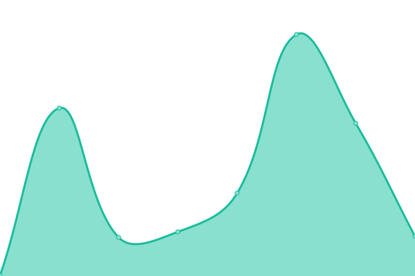

# [📈 Live Status](https://uptime.cust.app): <!--live status--> **🟧 Partial outage**

This repository contains the open-source uptime monitor and status page for [CustedNG](https://uptime.cust.app), powered by [Upptime](https://github.com/upptime/upptime).

With [Upptime](https://upptime.js.org), you can get your own unlimited and free uptime monitor and status page, powered entirely by a GitHub repository. We use [Issues](https://github.com/CustedNG/upptime/issues) as incident reports, [Actions](https://github.com/CustedNG/upptime/actions) as uptime monitors, and [Pages](https://uptime.cust.app) for the status page.

<!--start: status pages-->
<!-- This summary is generated by Upptime (https://github.com/upptime/upptime) -->
<!-- Do not edit this manually, your changes will be overwritten -->
<!-- prettier-ignore -->
| URL | Status | History | Response Time | Uptime |
| --- | ------ | ------- | ------------- | ------ |
|  [CustedNG](https://cust.app) | 🟥 Down | [custed-ng.yml](https://github.com/CustedNG/upptime/commits/HEAD/history/custed-ng.yml) | 

 494ms
     
 | 

<a href="https://uptime.cust.app/history/custed-ng">99.83%</a>
    

|  [Custed Backend](https://v2.custed.lolli.tech/) | 🟩 Up | [custed-backend.yml](https://github.com/CustedNG/upptime/commits/HEAD/history/custed-backend.yml) | 

 839ms
     
 | 

<a href="https://uptime.cust.app/history/custed-backend">100.00%</a>
    

|  [CustWiki](https://cust.wiki) | 🟩 Up | [cust-wiki.yml](https://github.com/CustedNG/upptime/commits/HEAD/history/cust-wiki.yml) | 

 671ms
     
 | 

<a href="https://uptime.cust.app/history/cust-wiki">100.00%</a>
    

|  [Cust+](https://cust.cc) | 🟩 Up | [cust.yml](https://github.com/CustedNG/upptime/commits/HEAD/history/cust.yml) | 

 463ms
     
 | 

<a href="https://uptime.cust.app/history/cust">100.00%</a>
    

<!--end: status pages-->

[**Visit our status website →**](https://uptime.cust.app)

## 📄 License

- Powered by: [Upptime](https://github.com/upptime/upptime)
- Code: [MIT](./LICENSE) © [CustedNG](https://uptime.cust.app)
- Data in the `./history` directory: [Open Database License](https://opendatacommons.org/licenses/odbl/1-0/)
